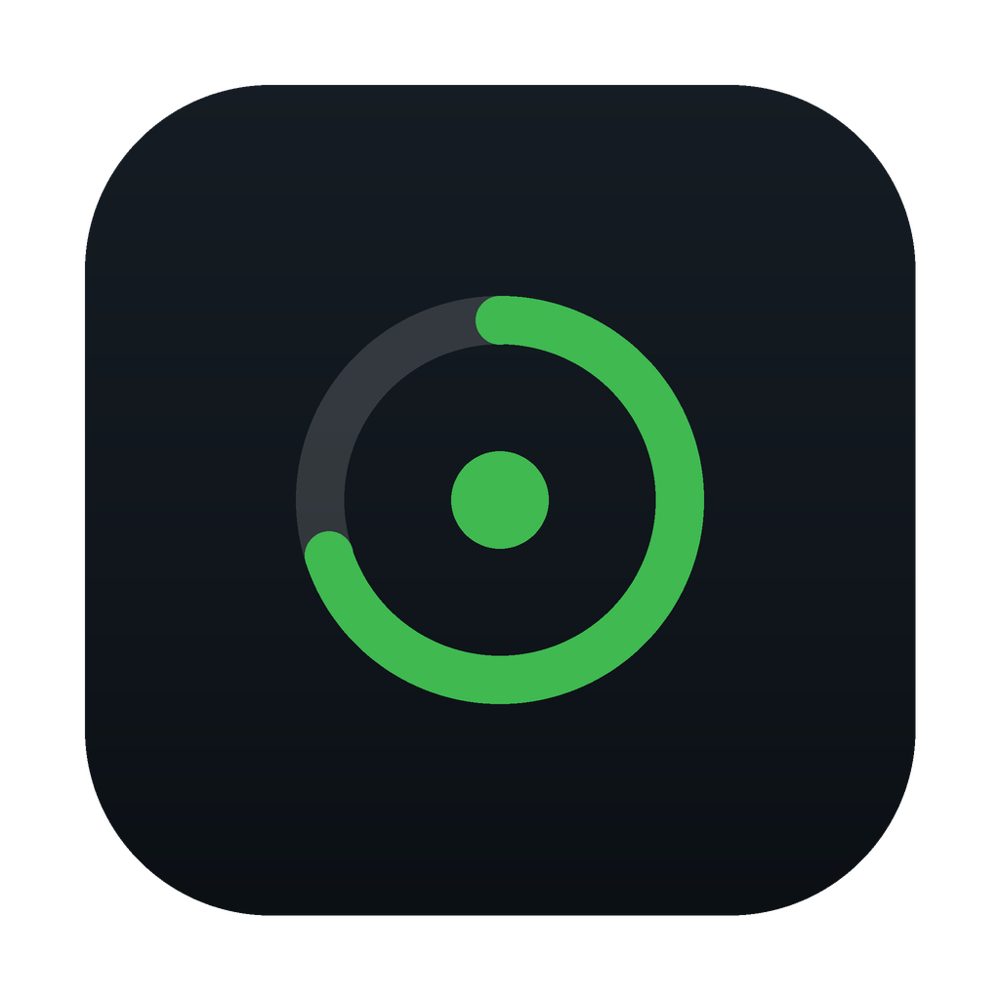
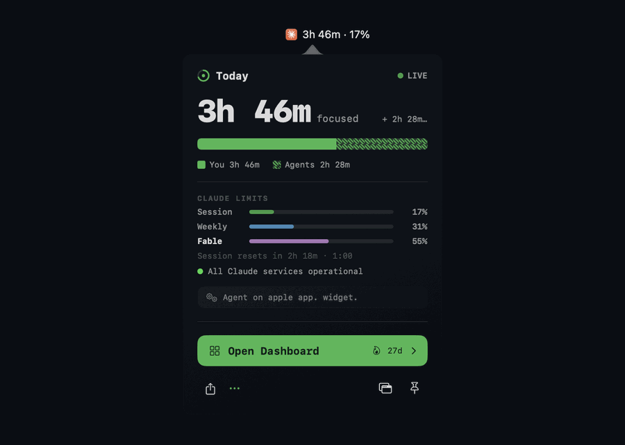
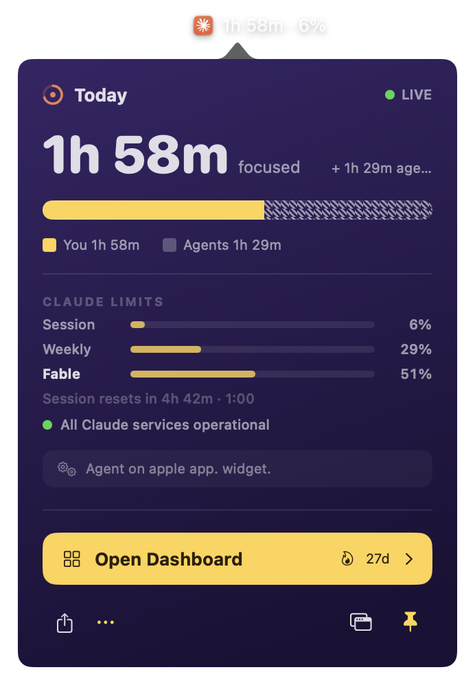
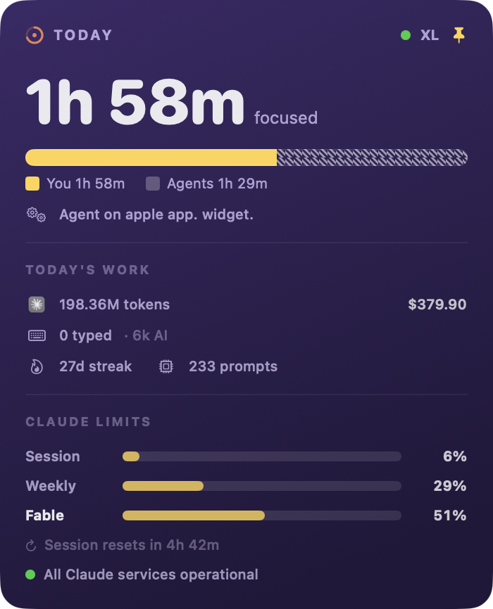
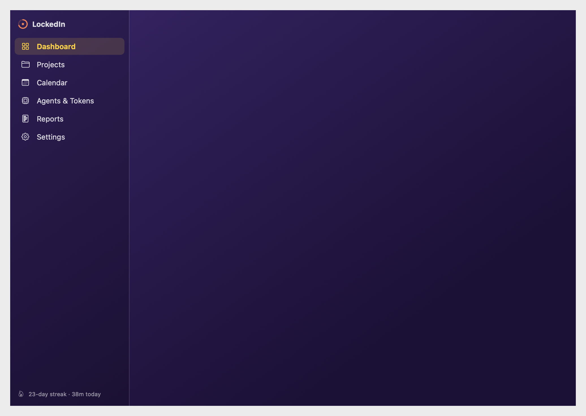

<p align="center"></p>

<h1 align="center">LockedIn</h1>

<p align="center"><b>An ambient, zero-input time tracker for the AI era.</b><br>
See the real you-vs-agent split for every project — no timers, all local.</p>

<p align="center">
  <a href="https://landing-zeta-coral.vercel.app"></a>
  
  
  <a href="https://github.com/itspavel/lockedin/releases"></a>
  <a href="LICENSE"></a>
  <a href=".github/workflows/ci.yml"></a>
</p>

LockedIn is a macOS menu-bar app that passively splits each project's day between *you*
and *your AI coding agents* — no timers to start, no buttons to press. It lives where
your eyes already are: the menu bar and an always-on desktop widget. It also watches
your **Claude usage limits** (Session / Weekly / Fable) live, with reset times, so you
never hit a wall mid-ship.

Built for indie hackers and solo builders who ship with Cursor and Claude Code and want
to know where their hours actually go — including the hours the agents put in.

<p align="center"></p>

<p align="center">
  
  &nbsp;&nbsp;
  
</p>

<p align="center"></p>

## Install

One line — no Gatekeeper prompt (macOS 14+, Apple Silicon & Intel, free beta):

```sh
curl -fsSL https://landing-zeta-coral.vercel.app/install | sh
```

Homebrew:

```sh
brew install --cask --no-quarantine itspavel/tap/lockedin
```

Or **[download the DMG](https://landing-zeta-coral.vercel.app/download)** (also on
[GitHub Releases](https://github.com/itspavel/lockedin/releases)) and drag to Applications.

> [!IMPORTANT]
> **"Apple could not verify LockedIn is free of malware"?** Expected for a
> browser-downloaded beta — the build isn't Developer-ID notarized yet (the $99/yr is
> on the list). It's a Gatekeeper policy block, **not** a permissions one, so running
> as administrator won't help. Fastest fix — clear the quarantine flag macOS added on
> download:
> ```sh
> xattr -dr com.apple.quarantine /Applications/LockedIn.app
> ```
> Or **System Settings → Privacy & Security → Open Anyway** (macOS 15), then open once
> more. The `curl … | sh` command above sidesteps all of this — curl downloads carry no
> quarantine flag.

Or build from source in ~30 seconds (see below). Updates surface in-app: the menu-bar
popover shows an "Update available" banner with release notes.

## Why

Manual time trackers die by week two — they live in a browser tab, out of sight, and the
start/stop friction kills them. Meanwhile the work itself has changed: you ship code while
barely typing, and every existing dev tracker is blind to the hours your agents worked.

LockedIn's answer: **zero input** (it auto-detects editor + agent activity) and a
**human/agent split** nobody else measures — the stat your build-in-public screenshot has
and theirs doesn't.

## How it works

- **HumanMonitor** — reads the frontmost app (`NSWorkspace`) and system idle time
  (`CGEventSource`). You're "working" when a tracked app is frontmost and you've given
  input recently. Zero permissions — no screen recording, no accessibility, no window
  titles. You choose which apps count in Settings.
- **AgentMonitor** — watches `~/.claude/projects/*/*.jsonl`. A session file written in the
  last ~70s means an agent is active; the project is the last `cwd` in the file. Parallel
  agents accrue cumulative time (2 agents × 30 min = 1h of agent work).
- **Tracker** — a 5-second tick loop attributes elapsed time to projects and persists one
  JSON file per day.
- **Tokens & cost** — incremental tail-read of the Claude Code logs accrues per-model token
  usage and an estimated API-equivalent cost.
- **Claude usage limits** — with your claude.ai session cookie, shows live Session / Weekly
  / model-scoped (e.g. Fable) limit % and reset times, and **notifies you at 80% / 95%**
  of any limit before it bites.
- **Claude status** — polls status.claude.com and can alert when a service you use goes
  down, so an outage never looks like your bug.
- **Shipped today** — per-project `git` commit + line counts since midnight (numbers only).
- **AI insights** — optional: with an Anthropic API key, Claude reads your numbers and
  tells you what they mean (peak focus hours, agent-heavy projects, pace vs limits).

### Privacy contract

LockedIn reads **timestamps, project paths, and usage counts only** — never the content of
your prompts, conversations, or code. All data stays on your Mac. The AI-insights feature
sends aggregate numbers and project names (never code or messages) to the Anthropic API,
and only when you press Generate.

## Build & run

```sh
./scripts/bundle.sh      # builds build/LockedIn.app
open build/LockedIn.app  # menu-bar only, no Dock icon (LSUIElement)

swift build              # quick compile check
./scripts/dmg.sh         # package a drag-to-install build/LockedIn-<ver>.dmg
```

Requirements: macOS 14+, Swift toolchain (no Xcode project needed — pure SwiftPM). The app
is ad-hoc signed, so first launch on another Mac needs a right-click → Open. Real
distribution needs Developer-ID signing + notarization (an Apple Developer account).

The optional editor sensor (typed-vs-AI-generated breakdown) installs via
`scripts/install-extension.sh` into Cursor / VS Code.

## Design

One **"Console" design system shared with the [website](https://landing-zeta-coral.vercel.app)**:
near-black terminal surfaces, a single green accent (`#3FB950`), monospaced numerals,
`$ command` voice, always dark. App tokens in
[`Sources/LockedIn/Theme.swift`](Sources/LockedIn/Theme.swift) deliberately mirror the
site's `globals.css` — change both together. The signature element is the **split bar**
(solid green = you, green hatch = agents); the brand mark is the "Ring Spark" — a progress
ring at your session % with a center dot. SF Symbols only, and the app icon is generated
from code via [`scripts/make_icon.py`](scripts/make_icon.py).

## Project layout

| Path | Role |
|---|---|
| `Sources/LockedIn/Tracker.swift` | 5s engine: sample monitors, attribute time, persist |
| `Sources/LockedIn/HumanMonitor.swift` | frontmost app + idle detection, "counts as work" list |
| `Sources/LockedIn/AgentMonitor.swift` | Claude Code JSONL scan (privacy-safe), token accrual |
| `Sources/LockedIn/Store.swift` | per-day JSON persistence, aggregates |
| `Sources/LockedIn/ClaudeUsage.swift` | claude.ai usage limits (Session/Weekly/Fable) |
| `Sources/LockedIn/AIInsights.swift` | Claude Messages API insights (cached per day) |
| `Sources/LockedIn/ClaudeStatus.swift` | status.claude.com polling + outage alerts |
| `Sources/LockedIn/GitStats.swift` | "Shipped today": commits + lines via git (counts only) |
| `Sources/LockedIn/Updater.swift` | in-app update checks against the appcast feed |
| `Sources/LockedIn/Notifier.swift` | notifications (UNUserNotificationCenter + fallback) |
| `Sources/LockedIn/PopoverView.swift` | menu-bar popover |
| `Sources/LockedIn/DesktopWidgetView.swift` | always-on desktop widget |
| `Sources/LockedIn/DashboardView.swift` | full dashboard (Projects, Calendar, Reports, Settings) |

The website lives in its own repo, [lockedin-site](https://github.com/itspavel/lockedin-site)
(terminal-themed, same design tokens); its `public/appcast.json` feeds in-app updates. Stage 1 (the Mirror) is built; WidgetKit widget, iOS companion, and
sync are later stages.

## Releasing

Releases ship as a notarized Developer ID DMG (direct download — the Mac App Store's
sandbox forbids this app's core function). The full pipeline is one command:
`SIGN_IDENTITY=... ./scripts/release.sh` — see [docs/RELEASE.md](docs/RELEASE.md).

## Contributing

PRs welcome — start with [CONTRIBUTING.md](CONTRIBUTING.md). The two hard rules:
the [privacy contract](#privacy-contract) (never read log *content*) and SF Symbols
only, no emoji. Security reports: [SECURITY.md](SECURITY.md) (privately, please).

## License

[MIT](LICENSE) © 2026 Pavel Tarasov
